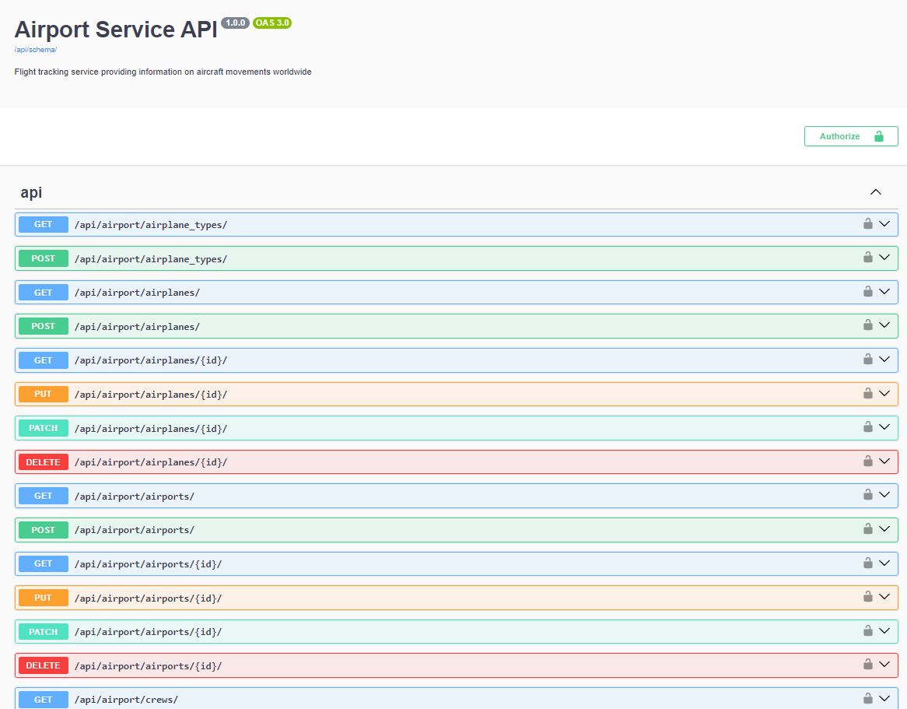
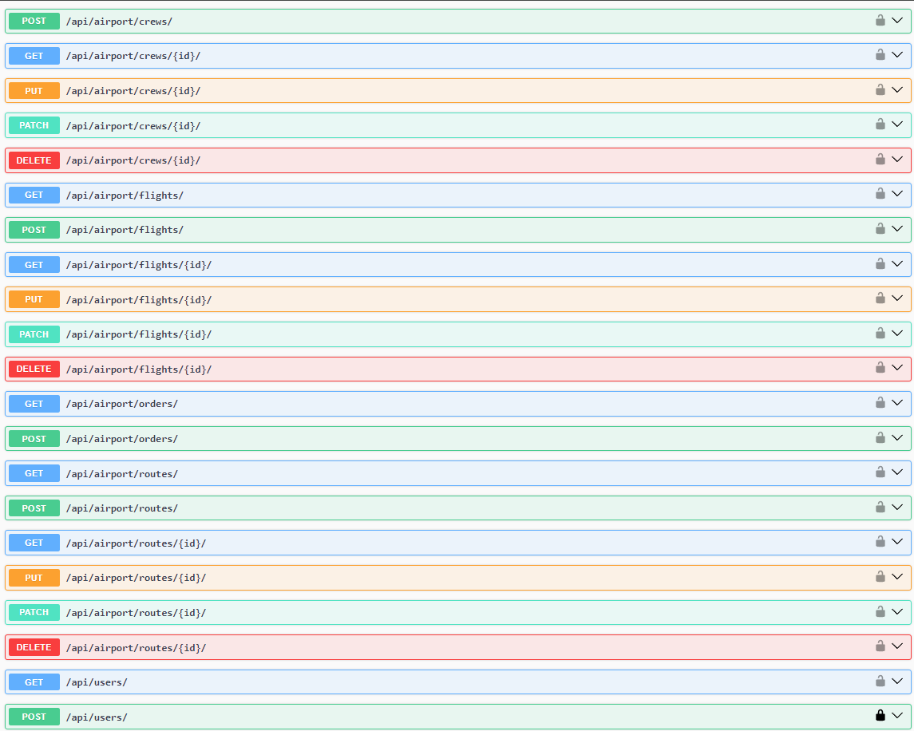
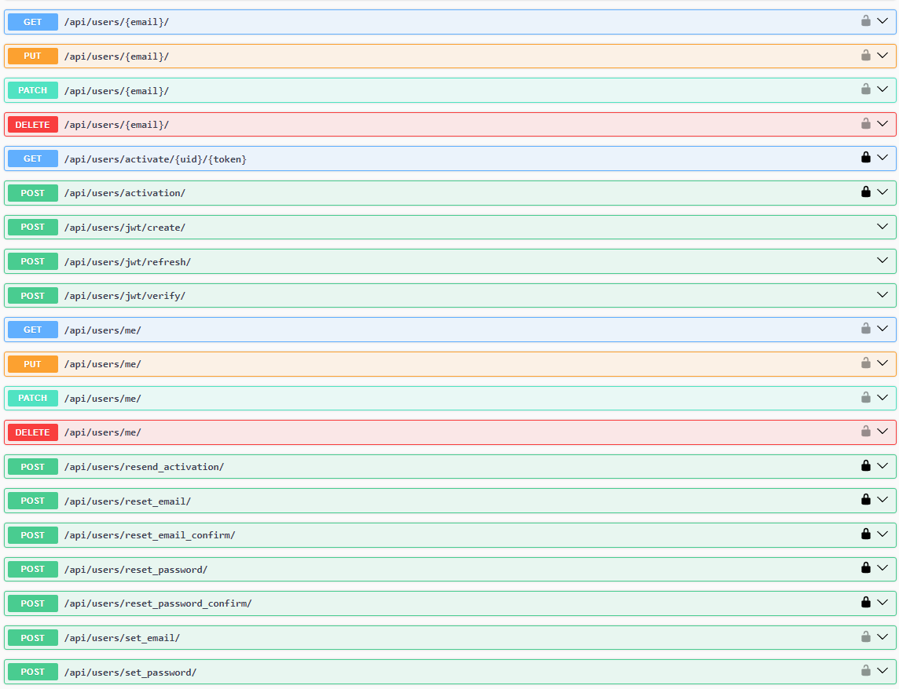

# Airport Api Service

Welcome to the Airport Api Service! This web application provides a comprehensive platform for managing tasks and user accounts within the aviation domain. Below is an enhanced guide to help you get started and contribute to the project.

# Features

1. **JWT Authentication:**
   Secure your API with JSON Web Token (JWT) authentication.

2. **Email Verification of Users:**
   Verify user emails to enhance security and ensure the validity of user accounts.

3. **Email Host Via smtp.gmail.com:**
   Utilize smtp.gmail.com as the email host for sending verification emails.

4. **Throttling:**
   Implement throttling mechanisms to control and limit request rates for improved system stability and security.

5. **Admin Panel:**
   Effortlessly manage various aspects of the system through an intuitive admin panel.

6. **API Documentation:**
   Explore comprehensive API documentation available at `/api/doc/swagger` for clear insights into endpoints and functionality.

7. **Task Management:**
   Efficiently manage tasks, including:

    - **Orders and Tickets**

    - **Creating Airplanes, Airports, Routes, Crew**

    - **Managing Flights**

    - **Adding Flights with Crew**

    - **Filtering Airports by City**

    - **Filtering Routes by Source, Destination**

    - **Filtering Flights by Routes, Date**

    - **Filtering Crew by First Name, Last Name**


## Getting Started

To set up and run the project locally, follow these steps:

### Create `.env` file

Create a `.env` file in the root of your project and define the necessary variables. You can use `.env.sample` as a template.


1. **Clone the Repository:**
    ```bash
    git clone https://github.com/AnyoneClown/Airport-API-Service.git
    ```

2. **Install Dependencies:**
    ```bash
    pip install -r requirements.txt
    ```

3. **Apply Database Migrations:**
    ```bash
    python manage.py migrate
    ```

4. **Fill the database with data:**
    ```bash
    python manage.py loaddata airport_service_db_data.json
    ```

5. **Start the Development Server:**
    ```bash
    python manage.py runserver
    ```
## Run with Docker

Ensure Docker is installed, and fill in the required environment variables in the `.env` file, use `.env.sample` as template. Once done, run the following commands:

1. **Build the Docker images:**
    ```bash
    docker-compose build
    ```

2. **Start the Docker containers:**
    ```bash
    docker-compose up
    ```

## Getting Access

To interact with the Airport API Service, follow these steps to create a user and obtain an access token:

1. **Create User:**
   Register a new user by making a POST request to `/api/user/register/`
2. **Verify User on your email:**
   Check your email for a verification letter containing a confirmation link. Click on the link to verify your registration.
3. **Get access token:**
   Obtain an access token by making a POST request to `/api/user/token/`


## Contributing

I welcome contributions to make this project even better. If you're interested in contributing, here's a step-by-step guide:

1. **Fork the Repository:**
   Click the "Fork" button on the top right of the repository's page to create your own fork.

2. **Create a New Branch:**
   Create a new branch for your feature or bug fix. Be descriptive with your branch name.

3. **Implement Your Changes:**
   Make your changes to the codebase. Ensure your code adheres to the project's coding standards.

4. **Test Thoroughly:**
   Test your changes rigorously to ensure they work as expected.

5. **Submit a Pull Request:**
   When ready, submit a pull request with details about your changes. Provide a clear and concise explanation of the problem and solution.

By following these guidelines, you'll contribute to the success of the Airport Api Service project. Thank you for your contributions!

## API Endpoints Overview


